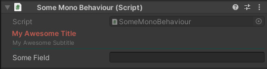

# ColoredTitleGroup

### Requires [Odin Inspector]

Lets you group class members inside a title group with customizable colors.

### Examples
```CSharp
using UnityEngine;

public class SomeMonoBehaviour : MonoBehaviour
{
    [ColoredTitleGroup("$GetTitle", Subtitle = "$GetSubtitle", TitleColor = "TitleColor", 
    SubtitleColor = "SubtitleColor", HorizontalLineColor = "HorizontalLineColor")]
    public string someField;

    private string GetTitle => "My Awesome Title";
    private string GetSubtitle => "My Awesome Subtitle";

    private Color TitleColor => new Color(0.98f, 0.46f, 0.41f, 1f);
    private Color SubtitleColor => new Color(0.69f, 0.72f, 0.70f, 1f);
    private Color HorizontalLineColor => new Color(0.09f, 0.29f, 0.27f, 1f);
}
```



### Usage
Simply put the downloaded ColoredTitleGroup folder in your project
and start using the attribute as in the example file.
You can move the files, but make sure that `ColoredTitleGroupAttribute.cs`
is not in an editor folder or it will be removed during build, causing errors.
Colors can be provided via [ValueResolvers].

[Odin Inspector]: https://odininspector.com/
[ValueResolvers]: https://odininspector.com/documentation/sirenix.odininspector.editor.valueresolvers.valueresolver-1
